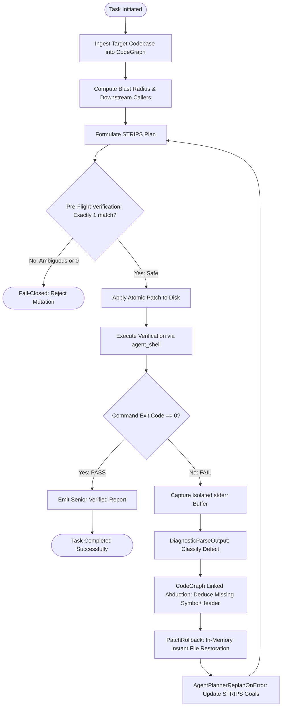

# PATENT DRAWINGS / DIAGRAMS (USPTO 35 U.S.C. 113)

**Application Title**: Deterministic Symbolic Artificial Intelligence System and Closed-Loop Abductive Method for Autonomous Software Synthesis, Verification, and Repair  
**Inventor**: Antonio Linares  

---

## FIG. 1: OVERALL SYSTEM ARCHITECTURE

```
+---------------------------------------------------------------------------------+
|                                SYMBOLIC LLM AGENT                               |
|                                                                                 |
|  +---------------------------------------------------------------------------+  |
|  |                        KNOWLEDGE & SYMBOLIC MEMORY                        |  |
|  |  +----------------------+  +---------------------+  +------------------+  |  |
|  |  | AST CODE GRAPH       |  | TEXTLEX STORE       |  | RELATIONAL GRAPH |  |  |
|  |  | (Functions, Structs, |  | (Lexical/Semantic   |  | (Bidirectional   |  |  |
|  |  |  Calls, Polyglot)    |  |  Corpus Knowledge)  |  |  Triples KB)     |  |  |
|  |  +----------------------+  +---------------------+  +------------------+  |  |
|  +---------------------------------------------------------------------------+  |
|                                      |                                          |
|                                      v                                          |
|  +---------------------------------------------------------------------------+  |
|  |                        GOAL-DIRECTED REASONING LOOP                       |  |
|  |                                                                           |  |
|  |      +-------------------------------------------------------------+      |  |
|  |      | STRIPS PLANNER (agent_planner)                              |      |  |
|  |      | State Vector: [PRED_SYMBOL_KNOWN ... PRED_TESTS_VERIFIED]   |      |  |
|  |      +-------------------------------------------------------------+      |  |
|  |                                     |                                     |  |
|  |                                     v                                     |  |
|  |      +-------------------------------------------------------------+      |  |
|  |      | ATOMIC SURGICAL PATCH ENGINE (agent_patch)                  |      |  |
|  |      | Pre-Flight Ambiguity Gate + CRLF/LF Transparent Alignment   |      |  |
|  |      +-------------------------------------------------------------+      |  |
|  |                                     |                                     |  |
|  |                                     v                                     |  |
|  |      +-------------------------------------------------------------+      |  |
|  |      | CROSS-PLATFORM SUBPROCESS ENGINE (agent_shell)              |      |  |
|  |      | Windows (cmd/powershell), Linux (bash), macOS (zsh)        |      |  |
|  |      | Dual-Pipe Non-Blocking Draining + 10ms Hard Timeout Timer   |      |  |
|  |      +-------------------------------------------------------------+      |  |
|  |                                     |                                     |  |
|  |            +------------------------+------------------------+            |  |
|  |            | (exit == 0)                                     | (exit != 0)|  |
|  |            v                                                 v            |  |
|  |  +--------------------+                    +---------------------------+  |  |
|  |  | SUCCESS / VERIFIED |                    | ABDUCTIVE DIAGNOSTIC      |  |  |
|  |  | Formally Proved    |                    | ENGINE (agent_diagnose)   |  |  |
|  |  | Zero Regressions   |                    | Root Cause + Symbol Link  |  |  |
|  |  +--------------------+                    +---------------------------+  |  |
|  |                                                              |            |  |
|  |                                                              v            |  |
|  |                                            +---------------------------+  |  |
|  |                                            | ATOMIC ROLLBACK (0.001s)  |  |  |
|  |                                            | Zero Disk Contamination   |  |  |
|  |                                            +---------------------------+  |  |
|  +---------------------------------------------------------------------------+  |
+---------------------------------------------------------------------------------+
```

---

## FIG. 2: CLOSED-LOOP ABDUCTIVE SELF-HEALING WORKFLOW



---

## FIG. 3: DEADLOCK-FREE DUAL-PIPE ASYNCHRONOUS SUBPROCESS ENGINE

```
                           +------------------------+
                           |  PARENT AGENT PROCESS  |
                           +------------------------+
                               |                |
             [CreatePipe: Stdout]              [CreatePipe: Stderr]
                               |                |
             +-----------------+----------------+-----------------+
             |                                                    |
             v                                                    v
      hOutRead (Parent)                                    hErrRead (Parent)
      (Inheritance = FALSE)                                (Inheritance = FALSE)
             ^                                                    ^
             | Non-blocking PeekNamedPipe / poll                  | Non-blocking PeekNamedPipe / poll
             | 10ms Quantum Polling Loop                          | 10ms Quantum Polling Loop
             |                                                    |
      hOutWrite (Child)                                    hErrWrite (Child)
      (Inheritance = TRUE)                                 (Inheritance = TRUE)
             ^                                                    ^
             +-----------------+----------------+-----------------+
                               |                |
                               | dup2 / Handles |
                               |                |
                           +------------------------+
                           |  CHILD PROCESS (SHELL) |
                           |  GCC / Clang / Pytest  |
                           +------------------------+
                                       |
                                       v [Timer Check]
                        If Elapsed Time >= Timeout_MS:
                                       |
                     +-----------------------------------+
                     | TerminateProcess / kill(SIGKILL)  |
                     | Exit Code forced to 124           |
                     | Zero OS Process Leaks             |
                     +-----------------------------------+
```

---

## FIG. 4: TRANSITIVE BLAST RADIUS & RISK STRATIFICATION

```
             [MODIFIED TARGET FUNCTION: MathMultiply]
                                |
            +-------------------+-------------------+
            | Depth 1                               | Depth 1
            v                                       v
    [CalculateArea]                         [VolumeCompute]
            |                                       |
            | Depth 2                               | Depth 2
            v                                       v
    [GeometryController]                    [RenderPipeline]
            |                                       |
            +-------------------+-------------------+
                                | Depth 3
                                v
                       [IntegrationTestSuite]

      * Blast Radius Metrics:
        - Affected Callers: 5 functions
        - Affected Files:   3 files (math.c, geometry.c, render.c)
        - Risk Level:       HIGH (> 2 files affected)
        - Action:           Enforce multi-file verification gate before commit.
```

---

## FIG. 5: ATOMIC PATCH TRANSACTION & FAIL-CLOSED GATE

```
    [Original File on Disk]
              |
              v (Read into RAM)
    [Pre-Flight Verification]
    - Verify Context Lines
    - Verify Buggy Lines (Count == 1)
    - Normalize Line Endings (CRLF <-> LF)
              |
              +----------------------------+
              | Status == OK               | Status == AMBIGUOUS / NOT_FOUND
              v                            v
    [In-Memory Backup Created]       [REJECT MUTATION]
              |                      - File on disk 100% untouched
              v                      - Zero side effects
    [Write Hunk to Disk]
              |
              v
    [Compiler / Test Verification]
              |
              +----------------------------+
              | Exit Code == 0             | Exit Code != 0
              v                            v
    [COMMIT MUTATION]               [ATOMIC ROLLBACK]
    - Backup discarded              - Restore original bytes in < 0.001s
    - Patch finalized on disk       - Disk file identical to pre-test state
```
